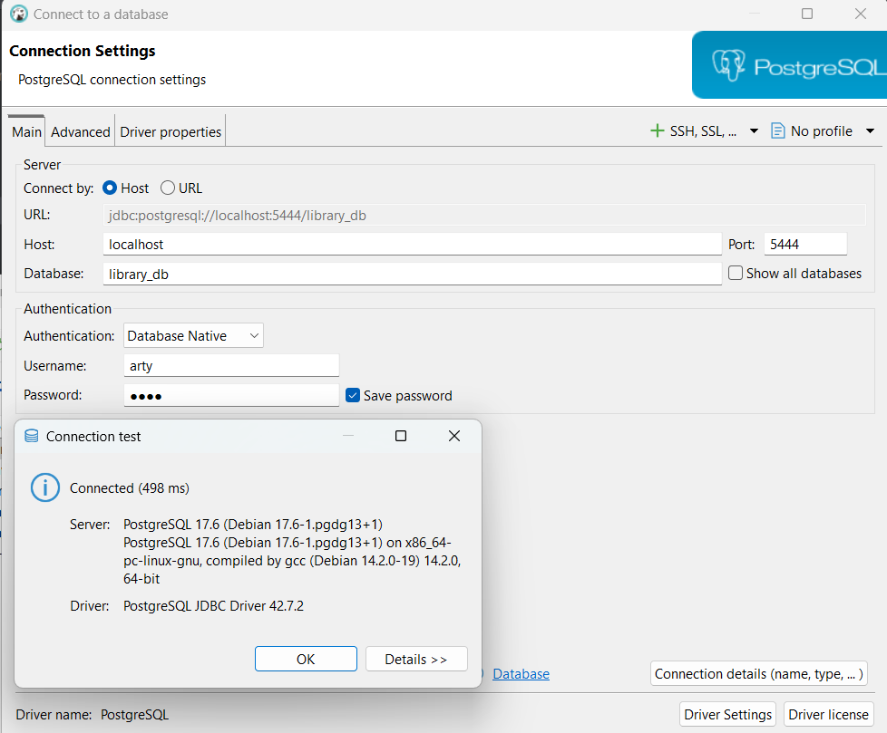

[step 1](#step1)
[step 2](#step-2)
### step1
 Создание docker-compose для создания контейнеров приложения и базы данных.</br>
 ветка: master. Приложение запускается из ide, база данных запускается в контейнере из docker-compose.yml
 ```yml
version: '3.9'

services:
  database:
    container_name: my_library_helper
    image: 'postgres:latest'
    environment:
      POSTGRES_DB: library_db
      POSTGRES_USER: arty
      POSTGRES_PASSWORD: arty
    ports:
      - '5444:5432'
 ```


### step 2

Создаем ветку для запуска приложения в docker контейнерах </br>
```bash
git checkout -b create-app-container
```

* Создаем bot-docker-compose.yml

```yml
version: '3.9'
services:
  database:
    image: postgres:16
    container_name: database
    restart: always
    environment:
      POSTGRES_DB: my_library_db
      POSTGRES_USER: arty
      POSTGRES_PASSWORD: arty
    volumes:
      - pgdata:/var/lib/postgresql/data
    ports:
      - "5443:5432"
    healthcheck:
      test: [ "CMD-SHELL", "pg_isready -U arty -d my_library_db" ]
      interval: 5s
      timeout: 5s
      retries: 1
      
  app:
   build: .
   container_name: my_library_tb
   environment:
    POSTGRES_HOST: database
    POSTGRES_PORT: 5443
    POSTGRES_DB: my_library_db
    POSTGRES_USER: arty
    POSTGRES_PASSWORD: arty
    BOT_USERNAME: Rubin21Kit
    BOT_TOKEN: 5435954816:AAGxInGouJ0OpPzTNoxC31dgxjXlwB52eeg
   ports:
    - "8082:8080"
   depends_on:
    database:
     condition: service_healthy
   restart: on-failure

volumes:
 pgdata:
```

* Необходимо создать Dockerfile

```dockerfile
# stage 1: build
FROM maven:3.9.4-eclipse-temurin-17 AS build
WORKDIR /app
COPY pom.xml .
COPY src ./src
RUN mvn clean package -DskipTests
# RUN mvn -B -DskipTests package

# stage 2: runtime
FROM eclipse-temurin:17-jdk-jammy
WORKDIR /app
COPY --from=build /app/target/*.jar app.jar
EXPOSE 8080
ENTRYPOINT ["java","-jar","/app/app.jar"]
```

* Изменим application.yml

```yml
spring:
  application:
    name: Telegram-Bot-BookLibrary

  datasource:
    url: jdbc:postgresql://${POSTGRES_HOST}:${POSTGRES_PORT}/${POSTGRES_DB}
    username: ${POSTGRES_USER}
    password: ${POSTGRES_PASSWORD}
    driver-class-name: org.postgresql.Driver
  jpa:
    properties:
      hibernate:
        format-ddl: true
        dialect: org.hibernate.dialect.PostgreSQLDialect
    hibernate:
      ddl-auto: update
    show-sql: true

bot:
  botUsername: ${BOT_USERNAME}
  botToken: ${BOT_TOKEN}
  
server:
  port: 8082

page:
  size: 2
```
Создадим также файл application-dev.yml
```yml
spring:
  datasource:
    url: jdbc:postgresql://localhost:5445/construction_db
    username: arty
    password: arty
    driver-class-name: org.postgresql.Driver

bot:
  botUsername: java test bot
  botToken: 7350864573:AAFRpqr2MsIPmeuJiPT6BXb06fE317McryA
  ```
в Run/Debug Configuration -> Modify Options -> Add VM Options -> (в окне добавить ' -Dspring.profiles.active=dev ')

Создадим также файл application-prod.yml
```yml
spring:
  datasource:
    url: jdbc:postgresql://${POSTGRES_HOST}:${POSTGRES_PORT}/${POSTGRES_DB}
    username: ${POSTGRES_USER}
    password: ${POSTGRES_PASSWORD}
    driver-class-name: org.postgresql.Driver

bot:
  botUsername: ${BOT_USERNAME}
  botToken: ${BOT_TOKEN}
```

Собрать и запустить контейнеры:
```bash
docker-compose -f bot-docker-compose.yml up -d
```